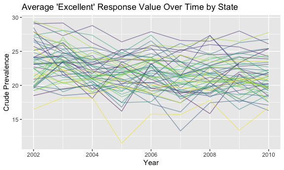
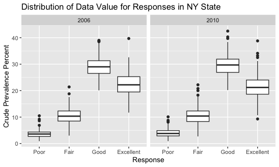

p8105_hw3_bac2214
================
Brianna Carnagie
2023-10-08

### Question 1

#### Loading the data

``` r
data("instacart") 
```

#### Exploring the data

``` r
instacart_reordered = 
  instacart |> 
  select(order_id, user_id, order_number, everything())

user_112108 = 
  instacart |>  
  filter(user_id == 112108)

user_17989 = 
  instacart |>  
  filter(user_id == 17989) 

user_17989_dept_frq = 
  user_17989 |> 
  count(department_id)
```

The dataset is a tibble that has 1384617 observations and 15 variables.
A few key variables in the dataset include an ‘order_id’, ‘user_id’,
which are the same, indicating that these are variables specific to each
instacart customer. Other important variables include ‘product_id’ and
‘product_name’, which give more details about the products purchased in
their instacart order.

- A user with user_id 112108 placed an order (with order_id = 1) on the
  fourth day of the week (order_dow = 4) at 10 am (order_hour_of_day =
  10). 9 days have passed since their previous order. In this order,
  they added “Bulgarian Yogurt” to their cart first (add_to_cart_order =
  1), which is found in the “yogurt” aisle of the “dairy eggs”
  department. This was their fourth instacart order (order_number = 4).

- A user with user_id 17989 had 28 items in their order, with the most
  popular department they shopped in being the department_id 4, which
  corresponds to fresh vegetables.

> How many aisles are there, and which aisles are the most items ordered
> from?

``` r
aisle_count = 
  instacart |>  
  distinct(aisle_id) |> 
  nrow()

aisle_top3 = 
  instacart |> 
  group_by(aisle_id) |> 
  summarize(n_obs = n()) |> arrange(desc(n_obs)) |> slice_head(n = 3) 
```

There are 134 total aisles. The top 3 aisles are in the table below!

| Aisle Number | Count  |
|--------------|--------|
| 83           | 150609 |
| 24           | 150473 |
| 123          | 78493  |

> Make a plot that shows the number of items ordered in each aisle,
> limiting this to aisles with more than 10000 items ordered. Arrange
> aisles sensibly, and organize your plot so others can read it.

``` r
instacart |> 
  count(aisle) |> 
  filter(n > 10000) |> 
  mutate(aisle = fct_reorder(aisle, n)) |> 
  ggplot(aes(x = aisle, y = n)) + 
  geom_point() + 
  labs(title = "Number of items ordered in each aisle") +
  theme(axis.text.x = element_text(angle = 60, hjust = 1))
```


> Make a table showing the three most popular items in each of the
> aisles “baking ingredients”, “dog food care”, and “packaged vegetables
> fruits”. Include the number of times each item is ordered in your
> table.

``` r
  instacart |> janitor::clean_names() |> 
  select(aisle, product_name) |> 
  group_by(aisle,product_name) |> 
  summarize(n_obs = n()) |> filter(aisle %in% c("baking ingredients","dog food care", "packaged vegetables fruits")) |> arrange(desc(n_obs)) |> slice_head(n = 3) |>  knitr::kable(digits = 4)
```

| aisle                      | product_name                                  | n_obs |
|:---------------------------|:----------------------------------------------|------:|
| baking ingredients         | Light Brown Sugar                             |   499 |
| baking ingredients         | Pure Baking Soda                              |   387 |
| baking ingredients         | Cane Sugar                                    |   336 |
| dog food care              | Snack Sticks Chicken & Rice Recipe Dog Treats |    30 |
| dog food care              | Organix Chicken & Brown Rice Recipe           |    28 |
| dog food care              | Small Dog Biscuits                            |    26 |
| packaged vegetables fruits | Organic Baby Spinach                          |  9784 |
| packaged vegetables fruits | Organic Raspberries                           |  5546 |
| packaged vegetables fruits | Organic Blueberries                           |  4966 |

> Make a table showing the mean hour of the day at which Pink Lady
> Apples and Coffee Ice Cream are ordered on each day of the week;
> format this table for human readers (i.e. produce a 2 x 7 table).

``` r
instacart |> janitor::clean_names() |> 
  select(order_dow, order_hour_of_day, product_name) |> 
  filter(product_name %in% c("Pink Lady Apples","Coffee Ice Cream")) |> 
  group_by(product_name, order_dow) |> 
  summarize(mean_hour = mean(order_hour_of_day)) |> 
  pivot_wider(
    names_from = order_dow, 
    values_from = mean_hour) |>
  knitr::kable(digits = 2)
```

    ## `summarise()` has grouped output by 'product_name'. You can override using the
    ## `.groups` argument.

| product_name     |     0 |     1 |     2 |     3 |     4 |     5 |     6 |
|:-----------------|------:|------:|------:|------:|------:|------:|------:|
| Coffee Ice Cream | 13.77 | 14.32 | 15.38 | 15.32 | 15.22 | 12.26 | 13.83 |
| Pink Lady Apples | 13.44 | 11.36 | 11.70 | 14.25 | 11.55 | 12.78 | 11.94 |

### Question 2

#### Loading the data

``` r
data("brfss_smart2010")
```

#### Cleaning the dataset

``` r
brfss_df = brfss_smart2010 |> 
  janitor::clean_names() |> 
  filter(topic == "Overall Health", response %in% c("Poor","Fair", "Good","Excellent")) |> 
  rename(crude_prevalence_percent = data_value) |> 
  select(year:sample_size, crude_prevalence_percent,everything(), -data_value_type, -data_value_unit) |> 
  mutate(response = factor(response, levels = c("Poor", "Fair", "Good", "Excellent")))
```

> In 2002, which states were observed at 7 or more locations? What about
> in 2010?

``` r
states_2002 = brfss_df |> 
  filter(year == 2002) |> 
  group_by(locationabbr) |>      
  summarise(n_obs = n_distinct(locationdesc)) |>   
  filter(n_obs >= 7) |>      
  pull(locationabbr)   
  
states_2010 = brfss_df |> 
  filter(year == 2010) |> 
  group_by(locationabbr) |>      
  summarise(n_obs = n_distinct(locationdesc)) |>   
  filter(n_obs >= 7) |>      
  pull(locationabbr) 
```

The states that were observed at 7 or more locations in 2002 were CT,
FL, MA, NC, NJ, PA. The states that were observed at 7 or more locations
in 2010 were CA, CO, FL, MA, MD, NC, NE, NJ, NY, OH, PA, SC, TX, WA.

> Construct a dataset that is limited to Excellent responses, and
> contains, year, state, and a variable that averages the data_value
> across locations within a state. Make a “spaghetti” plot of this
> average value over time within a state (that is, make a plot showing a
> line for each state across years – the geom_line geometry and group
> aesthetic will help).

``` r
excellent_df = brfss_df |> 
  filter(response == "Excellent") |> 
  group_by(year, locationabbr) |> 
  summarise(avg_value = mean(crude_prevalence_percent, na.rm = TRUE)) |> 
  ungroup()
```

    ## `summarise()` has grouped output by 'year'. You can override using the
    ## `.groups` argument.

``` r
ggplot(excellent_df, aes(x = year, y = avg_value, group = locationabbr)) +
  geom_line(aes(color = locationabbr), alpha = 0.5) +
  scale_color_viridis(discrete = TRUE, guide = "none")  +
  labs(title = "Average 'Excellent' Response Value Over Time by State",
       x = "Year",
       y = "Crude Prevalence",
       color = "State")
```



> Make a two-panel plot showing, for the years 2006, and 2010,
> distribution of data_value for responses (“Poor” to “Excellent”) among
> locations in NY State.

``` r
two_panel_df = brfss_df |> 
 filter(year %in% c(2006, 2010)) |> 
  group_by(year, locationabbr) 

  
ggplot(two_panel_df, aes(x = response, y = crude_prevalence_percent)) +
  geom_boxplot() +
  facet_wrap(~ year, scales = "free_x") +
  labs(title = "Distribution of Data Value for Responses in NY State",
       x = "Response",
       y = "Crude Prevalence Percent") 
```

    ## Warning: Removed 7 rows containing non-finite values (`stat_boxplot()`).



### Question 3

#### Loading the data

``` r
nhanes_accel = read_csv("data/nhanes_accel.csv")
```

    ## Rows: 250 Columns: 1441
    ## ── Column specification ────────────────────────────────────────────────────────
    ## Delimiter: ","
    ## dbl (1441): SEQN, min1, min2, min3, min4, min5, min6, min7, min8, min9, min1...
    ## 
    ## ℹ Use `spec()` to retrieve the full column specification for this data.
    ## ℹ Specify the column types or set `show_col_types = FALSE` to quiet this message.

``` r
nhanes_covar = read_csv("data/nhanes_covar.csv", skip = 4)
```

    ## Rows: 250 Columns: 5
    ## ── Column specification ────────────────────────────────────────────────────────
    ## Delimiter: ","
    ## dbl (5): SEQN, sex, age, BMI, education
    ## 
    ## ℹ Use `spec()` to retrieve the full column specification for this data.
    ## ℹ Specify the column types or set `show_col_types = FALSE` to quiet this message.

Load, tidy, merge, and otherwise organize the data sets. Your final
dataset should include all originally observed variables; exclude
participants less than 21 years of age, and those with missing
demographic data; and encode data with reasonable variable classes
(i.e. not numeric, and using factors with the ordering of tables and
plots in mind).

#### Cleaning and merging the datasets

``` r
nhanes_accel_tidy = nhanes_accel |> 
  janitor::clean_names() |> 
  pivot_longer(
     min1:min1440,
    names_to = "minute",
    names_prefix = "min",
    values_to = "mims") 
 
nhanes_covar_tidy = nhanes_covar |> 
  janitor::clean_names() |> 
  mutate(
    sex = case_when(
      sex == 1 ~ "male",
      sex == 2 ~ "female"
    ),
    education = case_when(
      education == 1 ~ "Less than high school",
      education == 2 ~ "High school equivalent",
      education == 3 ~ "More than high school"))

nhanes_merge_df = full_join(nhanes_accel_tidy, nhanes_covar_tidy, by = "seqn") |> 
  janitor::clean_names() |> 
  filter(
    age >= 21, 
    if_all(c(seqn, minute, mims, sex, age, bmi, education), ~ !is.na(.))
  ) |> 
  mutate(education = factor(education, levels = c("Less than high school", "High school equivalent", "More than high school")))
```

> Produce a reader-friendly table for the number of men and women in
> each education category, and create a visualization of the age
> distributions for men and women in each education category. Comment on
> these items.

``` r
gender_df = nhanes_merge_df |> 
  group_by(sex, education) |> 
  summarize(n_obs = n_distinct(seqn)) 
```

    ## `summarise()` has grouped output by 'sex'. You can override using the `.groups`
    ## argument.

``` r
gender_tbl = gender_df |>  
  knitr::kable(digits = 4)


gender_plot = ggplot(gender_df, aes(x = education, y = n_obs)) +
  geom_bar(stat = "identity", position = "dodge") + 
  labs(title = "Number of Participants by Education Level",
       x = "Education Level",
       y = "Number of Participants") +
  facet_wrap(~sex, ncol = 2)
```

- Based on the data, more females in the study completed more then high
  school compared to males.
- However, more males completed the equivalent of high school compared
  to females.

> Traditional analyses of accelerometer data focus on the total activity
> over the day. Using your tidied dataset, aggregate across minutes to
> create a total activity variable for each participant. Plot these
> total activities (y-axis) against age (x-axis); your plot should
> compare men to women and have separate panels for each education
> level. Include a trend line or a smooth to illustrate differences.
> Comment on your plot.

> Accelerometer data allows the inspection activity over the course of
> the day. Make a three-panel plot that shows the 24-hour activity time
> courses for each education level and use color to indicate sex.
> Describe in words any patterns or conclusions you can make based on
> this graph; including smooth trends may help identify differences.
