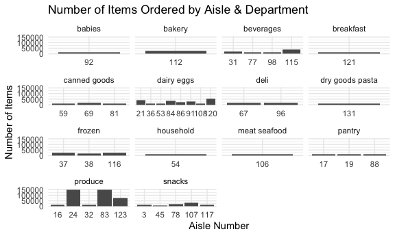

p8105_hw3_bac2214
================
Brianna Carnagie
2023-10-08

### Question 1

#### Loading the data

``` r
data("instacart") 
```

#### Exploring the data

``` r
instacart_reordered = 
  instacart |> 
  select(order_id, user_id, order_number, everything())

user_112108 = 
  instacart |>  
  filter(user_id == 112108)

user_17989 = 
  instacart |>  
  filter(user_id == 17989) 

user_17989_dept_frq = 
  user_17989 |> 
  count(department_id)
```

The dataset is a tibble that has 1384617 observations and 15 variables.
A few key variables in the dataset include an ‘order_id’, ‘user_id’,
which are the same, indicating that these are variables specific to each
instacart customer. Other important variables include ‘product_id’ and
‘product_name’, which give more details about the products purchased in
their instacart order.

- A user with user_id 112108 placed an order (with order_id = 1) on the
  fourth day of the week (order_dow = 4) at 10 am (order_hour_of_day =
  10). 9 days have passed since their previous order. In this order,
  they added “Bulgarian Yogurt” to their cart first (add_to_cart_order =
  1), which is found in the “yogurt” aisle of the “dairy eggs”
  department. This was their fourth instacart order (order_number = 4).

- A user with user_id 17989 had 28 items in their order, with the most
  popular department they shopped in being the department_id 4, which
  corresponds to fresh vegetables.

> How many aisles are there, and which aisles are the most items ordered
> from?

``` r
aisle_count = 
  instacart |>  
  distinct(aisle_id) |> 
  nrow()

aisle_top3 = 
  instacart |> 
  group_by(aisle_id) |> 
  summarize(n_obs = n()) |> arrange(desc(n_obs)) |> slice_head(n = 3) 
```

There are 134 total aisles. The top 3 aisles are in the table below!

| Aisle Number | Count  |
|--------------|--------|
| 83           | 150609 |
| 24           | 150473 |
| 123          | 78493  |

> Make a plot that shows the number of items ordered in each aisle,
> limiting this to aisles with more than 10000 items ordered. Arrange
> aisles sensibly, and organize your plot so others can read it.

``` r
instacart |> 
  group_by(aisle_id, department) |> 
  summarize(n_obs = n()) |> 
  filter(n_obs > 10000)|> 
  ggplot( aes(x = as.factor(aisle_id), y = n_obs)) +
  geom_bar(stat = "identity") +
  labs(title = "Number of Items Ordered by Aisle & Department", x = "Aisle Number", y = "Number of Items") +
  theme_minimal() +
  facet_wrap(~ department, scales = "free_x") 
```



> Make a table showing the three most popular items in each of the
> aisles “baking ingredients”, “dog food care”, and “packaged vegetables
> fruits”. Include the number of times each item is ordered in your
> table.

``` r
  instacart |> janitor::clean_names() |> 
  select(aisle, product_name) |> 
  group_by(aisle,product_name) |> 
  summarize(n_obs = n()) |> filter(aisle %in% c("baking ingredients","dog food care", "packaged vegetables fruits")) |> arrange(desc(n_obs)) |> slice_head(n = 3) |>  knitr::kable(digits = 4)
```

| aisle                      | product_name                                  | n_obs |
|:---------------------------|:----------------------------------------------|------:|
| baking ingredients         | Light Brown Sugar                             |   499 |
| baking ingredients         | Pure Baking Soda                              |   387 |
| baking ingredients         | Cane Sugar                                    |   336 |
| dog food care              | Snack Sticks Chicken & Rice Recipe Dog Treats |    30 |
| dog food care              | Organix Chicken & Brown Rice Recipe           |    28 |
| dog food care              | Small Dog Biscuits                            |    26 |
| packaged vegetables fruits | Organic Baby Spinach                          |  9784 |
| packaged vegetables fruits | Organic Raspberries                           |  5546 |
| packaged vegetables fruits | Organic Blueberries                           |  4966 |

> Make a table showing the mean hour of the day at which Pink Lady
> Apples and Coffee Ice Cream are ordered on each day of the week;
> format this table for human readers (i.e. produce a 2 x 7 table).

``` r
instacart |> janitor::clean_names() |> 
  select(order_dow, order_hour_of_day, product_name) |> 
  filter(product_name %in% c("Pink Lady Apples","Coffee Ice Cream")) |> 
  group_by(product_name, order_dow) |> 
  summarize(mean_hour = mean(order_hour_of_day)) |> 
  pivot_wider(
    names_from = order_dow, 
    values_from = mean_hour) |>
  knitr::kable(digits = 2)
```

    ## `summarise()` has grouped output by 'product_name'. You can override using the
    ## `.groups` argument.

| product_name     |     0 |     1 |     2 |     3 |     4 |     5 |     6 |
|:-----------------|------:|------:|------:|------:|------:|------:|------:|
| Coffee Ice Cream | 13.77 | 14.32 | 15.38 | 15.32 | 15.22 | 12.26 | 13.83 |
| Pink Lady Apples | 13.44 | 11.36 | 11.70 | 14.25 | 11.55 | 12.78 | 11.94 |
